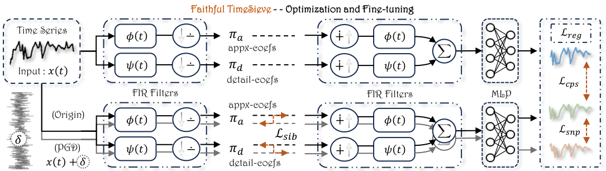
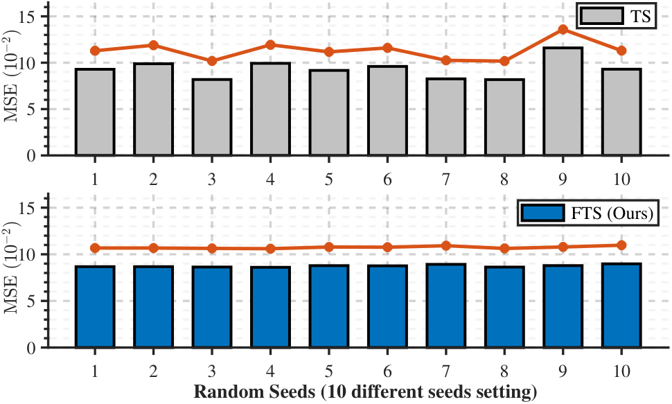

# FTS: From Guesswork to Guarantee — Faithful Multimedia Web Forecasting with TimeSieve

[](LICENSE)
[](https://xll0328.github.io/fts/)

**This paper was accepted at ACM MM 2025** (33rd ACM International Conference on Multimedia, October 27–31, 2025, Dublin, Ireland). CCF A, Core A\*. This repository is the official implementation of **Faithful TimeSieve (FTS)**.

| [**Project Page**](https://xll0328.github.io/fts/) | [**Code (GitHub)**](https://github.com/xll0328/MM25-FTS) |
|:---:|:---:|
| [xll0328.github.io/fts](https://xll0328.github.io/fts/) | [GitHub](https://github.com/xll0328/MM25-FTS) |

**Authors:** Songning Lai, Ninghui Feng, Jiechao Gao, Hao Wang, Haochen Sui, Xin Zou, Jiayu Yang, Wenshuo Chen, Lijie Hu, Hang Zhao, Xuming Hu, Yutao Yue

---

## Framework (from paper)

<p align="center">
  
</p>
<p align="center"><strong>Framework of our proposed Faithful TimeSieve (FTS).</strong></p>

---

## Overview

**Faithful TimeSieve (FTS)** is an enhanced framework for improving the **reliability and robustness** of time series forecasting in multimedia-rich web settings (e.g. video streaming workloads, ad click prediction). While [TimeSieve](https://github.com/ninghuifeng/TimeSieve) achieves strong accuracy, it is sensitive to **random seeds**, **input noise**, **layer noise**, and **parameter perturbations**. FTS systematically detects and mitigates these unfaithfulness issues via a rigorous definition and three auxiliary losses:

Formally, the three attributes are (ω = original weights, ω̃ = fine-tuned weights; D₁, D₂, D₃ are distances, ‖·‖ a norm):

- **Sib (Similarity in IB Space):** D₁ between approximation/detail representations under perturbation ≤ β for all ‖δ‖ ≤ R₁.
- **Cps (Consistency in Prediction Space):** D₂ between predictions under ω̃ and ω ≤ α₁.
- **Snp (Stability in Noise Perturbations):** D₃ between predictions under x(t) and x(t)+δ ≤ α₂ for all ‖δ‖ ≤ R₂.

Sib:

$$D_1(\hat{\pi}_a(x(t)), \hat{\pi}_a(x(t)+\delta)) \leq \beta \quad \text{(and similarly for } \hat{\pi}_d\text{).}$$

Cps:

$$D_2(y(x(t), \tilde{\omega}), y(x(t), \omega)) \leq \alpha_1.$$

Snp:

$$D_3(y(x(t), \tilde{\omega}), y(x(t)+\delta, \tilde{\omega})) \leq \alpha_2.$$

The total training objective is:

$$\mathcal{L} = \mathcal{L}_{\mathrm{reg}} + \mathcal{L}_{\mathrm{IB}} + \lambda_1 \mathcal{L}_{\mathrm{sib}} + \lambda_2 \mathcal{L}_{\mathrm{cps}} + \lambda_3 \mathcal{L}_{\mathrm{snp}}$$

Here **L**<sub>reg</sub> is the regression loss, **L**<sub>IB</sub> is the TimeSieve IB loss, and **L**<sub>sib</sub>, **L**<sub>cps</sub>, **L**<sub>snp</sub> are the faithfulness auxiliary losses. FTS uses PGD to find worst-case perturbations and batched gradient updates for parameters, achieving **SOTA** on multiple benchmarks while improving stability and consistency.

---

## Key Contributions (from paper)

1. **Comprehensive Faithfulness Assessment** — In-depth analysis of TimeSieve identifying factors that affect its faithfulness (random seeds, input/layer/parameter perturbations).
2. **Definition of Faithful TimeSieve** — Rigorous (α₁, α₂, β, δ, R₁, R₂)-Faithful definition with three attributes (Sib, Cps, Snp).
3. **Multimedia-aware Robustness Framework** — Min-max optimization with PGD and content-adaptive stabilization; framework transfers to other time series models (e.g. PatchTST).
4. **Theoretical and Experimental Validation** — Bounds for Sib/Cps/Snp and extensive experiments on Wiki, ETTh1, Exchange; FTS achieves SOTA and strong robustness.

---

## Table of Contents

- [Framework](#framework-from-paper)
- [Method](#method)
- [Main Results (Tables)](#main-results-tables)
- [Installation](#installation)
- [Project Structure](#project-structure)
- [Data & Usage](#data--usage)
- [Citation](#citation)
- [License](#license)

---

## Method

**TimeSieve** uses wavelet decomposition (approximation π_a, detail π_d) and an Information Filtering and Compression Block (IFCB) with IB loss. FTS adds:

- **Objective:** Minimize the sum of **L**<sub>sib</sub>, **L**<sub>cps</sub>, **L**<sub>snp</sub> over fine-tuned weights; **L**<sub>sib</sub> ties to distance D₁ in IB space, **L**<sub>cps</sub> to D₂ between predictions, **L**<sub>snp</sub> to D₃ under input perturbation.
- **PGD step:** At each iteration, update perturbation by gradient ascent on the sum of these distances (project to ‖δ‖ ≤ R), then update weights by gradient descent on the full loss.
- **Lookback:** Input length T = 2H (twice the forecast horizon H).

---

## Main Results (Tables)

### Table 1: Forecasting results (no perturbation)

Forecast length H ∈ {48, 96, 144, 192}, lookback T = 2H. Best: **bold**. Second best: *italics*.

| Dataset | H | FTS (MAE / MSE) | TS (MAE / MSE) | Koopa | PatchTST | TSMixer | DLinear | NSTformer | LightTS | Autoformer |
|---------|---|------------------|----------------|-------|----------|---------|---------|-----------|---------|------------|
| **Wiki** | 48 | **0.305 / 0.467** | 0.323 / *0.490* | 0.314 / 0.496 | 0.312 / 0.495 | 0.318 / *0.490* | 0.350 / 0.517 | *0.307* / 0.508 | 0.313 / 0.494 | 0.315 / 0.522 |
| | 96 | **0.262 / 0.430** | *0.266 / 0.433* | 0.283 / 0.451 | 0.280 / 0.445 | 0.277 / 0.435 | 0.286 / 0.462 | 0.303 / 0.633 | 0.287 / 0.460 | 0.348 / 0.550 |
| | 144 | **0.268 / 0.445** | *0.270 / 0.447* | 0.284 / 0.459 | 0.280 / 0.451 | 0.320 / 0.496 | 0.287 / 0.458 | 0.309 / 0.521 | 0.291 / 0.471 | 0.360 / 0.616 |
| | 192 | **0.273 / 0.447** | *0.276 / 0.452* | 0.294 / 0.467 | 0.289 / 0.461 | 0.370 / 0.644 | 0.289 / 0.463 | 0.339 / 0.605 | 0.301 / 0.490 | 0.373 / 0.629 |
| **ETTh1** | 48 | **0.360 / 0.340** | *0.361 / 0.341* | 0.385 / 0.364 | 0.375 / 0.342 | 0.432 / 0.407 | 0.372 / 0.342 | 0.465 / 0.614 | 0.406 / 0.404 | 0.432 / 0.678 |
| | 96 | **0.383 / 0.376** | *0.384 / 0.376* | 0.411 / 0.406 | 0.395 / 0.377 | 0.473 / 0.466 | 0.395 / 0.380 | 0.498 / 0.653 | 0.431 / 0.435 | 0.496 / 0.578 |
| | 144 | **0.396 / 0.391** | *0.397 / 0.393* | 0.426 / 0.424 | 0.412 / 0.394 | 0.528 / 0.537 | 0.401 / 0.394 | 0.536 / 0.602 | 0.442 / 0.453 | 0.521 / 0.761 |
| | 192 | **0.406 / 0.402** | *0.408 / 0.402* | 0.434 / 0.430 | 0.437 / 0.416 | 0.592 / 0.642 | 0.416 / 0.408 | 0.543 / 0.684 | 0.457 / 0.471 | 0.568 / 0.598 |
| **Exchange** | 48 | **0.139 / 0.042** | *0.140 / 0.043* | 0.149 / 0.046 | 0.145 / 0.048 | 0.149 / 0.046 | 0.145 / 0.046 | 0.187 / 0.073 | 0.159 / 0.067 | 0.205 / 0.124 |
| | 96 | **0.196 / 0.084** | *0.197 / 0.086* | 0.211 / 0.092 | 0.204 / 0.090 | 0.211 / 0.092 | 0.223 / 0.089 | 0.294 / 0.159 | 0.247 / 0.168 | 0.778 / 0.409 |
| | 144 | **0.242 / 0.123** | *0.243 / 0.124* | 0.265 / 0.141 | 0.265 / 0.138 | 0.265 / 0.141 | 0.256 / 0.133 | 0.375 / 0.292 | 0.272 / 0.310 | 0.680 / 0.671 |
| | 192 | **0.287 / 0.170** | *0.292 / 0.179* | 0.329 / 0.212 | 0.298 / 0.181 | 0.329 / 0.212 | 0.301 / 0.182 | 0.464 / 0.494 | 0.354 / 0.403 | 0.979 / 0.544 |

### Table 2: Random seed stability (Exchange, 96-step, MSE)

Baseline seed 2021*. FTS is less sensitive to seeds; **Preference (%)** quantifies combined performance and stability (higher = FTS preferred).

| Seed | TS (MSE) | FTS (MSE) | Preference (%) |
|------|----------|-----------|----------------|
| 2021* | 0.0929 | 0.0868 | — |
| 2022 | 0.0989 | 0.0867 | **99.61%** |
| 2023 | 0.0819 | 0.0864 | **96.09%** |
| 2024 | 0.0993 | 0.0860 | **87.95%** |
| 2025 | 0.0917 | 0.0878 | **4.49%** |
| 2026 | 0.0960 | 0.0876 | **69.27%** |
| 2027 | 0.0826 | 0.0892 | **74.16%** |
| 2028 | 0.0818 | 0.0863 | **95.81%** |
| 2029 | 0.1160 | 0.0879 | **94.69%** |
| 2030 | 0.0897 | 0.0898 | **1.53%** |

### Table 3: Robustness under perturbation (MAE / MSE)

NP = no perturbation, NPO = NP with FTS optimization, IP = input perturbation, IPO = IP with optimization, ILP = intermediate-layer perturbation, ILPO = ILP with optimization. Underline = FTS (improved).

| Dataset | H | NP (MAE/MSE) | NPO (MAE/MSE) | IP (MAE/MSE) | IPO (MAE/MSE) | ILP (MAE/MSE) | ILPO (MAE/MSE) |
|---------|---|--------------|---------------|--------------|---------------|---------------|----------------|
| Wiki | 48 | 0.323/0.490 | **0.305/0.467** | 0.433/0.608 | **0.367/0.531** | 0.453/0.590 | **0.399/0.551** |
| Wiki | 96 | 0.266/0.433 | **0.262/0.430** | 0.405/0.575 | **0.321/0.482** | 0.367/0.681 | **0.329/0.613** |
| Wiki | 144 | 0.270/0.447 | **0.268/0.445** | 0.409/0.600 | **0.326/0.542** | 0.375/0.967 | **0.305/0.723** |
| Wiki | 192 | 0.276/0.452 | **0.273/0.447** | 0.408/0.580 | **0.327/0.493** | 0.404/1.548 | **0.366/1.165** |
| ETTh1 | 48 | 0.361/0.341 | **0.360/0.340** | 0.386/0.375 | **0.376/0.361** | 0.437/0.456 | **0.392/0.392** |
| ETTh1 | 96 | 0.384/0.377 | **0.383/0.376** | 0.411/0.424 | **0.404/0.408** | 0.415/0.422 | **0.401/0.397** |
| ETTh1 | 144 | 0.397/0.393 | **0.396/0.391** | 0.422/0.437 | **0.413/0.422** | 0.483/0.520 | **0.447/0.472** |
| ETTh1 | 192 | 0.408/0.404 | **0.406/0.402** | 0.431/0.445 | **0.420/0.426** | 0.443/0.451 | **0.428/0.430** |
| Exchange | 48 | 0.140/0.043 | **0.139/0.042** | 0.220/0.102 | **0.186/0.073** | 0.160/0.045 | **0.148/0.044** |
| Exchange | 96 | 0.197/0.086 | **0.196/0.084** | 0.265/0.131 | **0.237/0.104** | 0.221/0.102 | **0.202/0.092** |
| Exchange | 144 | 0.243/0.124 | **0.242/0.123** | 0.312/0.175 | **0.271/0.141** | 0.292/0.164 | **0.253/0.149** |
| Exchange | 192 | 0.292/0.179 | **0.287/0.170** | 0.345/0.239 | **0.307/0.178** | 0.331/0.205 | **0.304/0.190** |

### Table 4: Loss ablation (ETTh1 & Exchange, MAE / MSE)

**L**<sub>total</sub> = **L**<sub>reg</sub> + **L**<sub>IB</sub> + λ₁**L**<sub>sib</sub> + λ₂**L**<sub>cps</sub> + λ₃**L**<sub>snp</sub>. Best in **bold**, second in *italics*.

| Dataset | H | **L**<sub>total</sub> | **L**<sub>no_snp</sub> | **L**<sub>no_cps</sub> | **L**<sub>no_sib</sub> | no (cps+sib) | no (snp+sib) | no (snp+cps) | no (all 3) |
|---------|---|------------------------|------------------------|------------------------|------------------------|--------------|--------------|--------------|------------|
| ETTh1 | 48 | **0.376/0.361** | 0.383/0.370 | 0.381/*0.363* | *0.378*/*0.361* | 0.381/0.365 | 0.383/0.370 | 0.384/0.372 | 0.382/0.371 |
| ETTh1 | 96 | **0.404/0.408** | 0.409/0.419 | 0.405/0.410 | *0.404*/*0.408* | 0.404/0.410 | 0.410/0.419 | 0.411/0.421 | 0.410/0.420 |
| ETTh1 | 144 | **0.413/0.422** | 0.423/0.431 | *0.413*/0.423 | 0.417/*0.422* | 0.414/0.422 | 0.423/0.431 | 0.423/0.430 | 0.420/0.429 |
| ETTh1 | 192 | **0.420/0.426** | 0.425/0.433 | 0.428/0.431 | *0.423*/*0.426* | 0.425/0.430 | 0.428/0.433 | 0.430/0.433 | 0.427/0.429 |
| Exchange | 48 | **0.186/0.073** | 0.195/*0.078* | 0.190/0.084 | 0.191/0.074 | *0.190*/0.085 | 0.195/0.078 | 0.197/0.083 | 0.195/0.080 |
| Exchange | 96 | *0.237*/**0.104** | 0.238/0.112 | 0.242/0.126 | **0.235**/*0.106* | 0.242/0.126 | 0.238/0.112 | 0.244/0.139 | 0.241/0.137 |
| Exchange | 144 | *0.271*/*0.141* | 0.277/0.150 | 0.281/0.177 | **0.270**/**0.139** | 0.281/0.178 | 0.278/0.150 | 0.280/0.192 | 0.280/0.188 |
| Exchange | 192 | *0.307*/**0.178** | 0.309/0.191 | 0.317/0.236 | **0.305**/*0.180* | 0.318/0.236 | 0.310/0.188 | 0.314/0.254 | 0.314/0.254 |

---

## Figure 1: TS vs FTS under 10 random seeds (from paper)

<p align="center">
  
</p>
<p align="center"><strong>Ten different random seeds are selected to train TimeSieve (TS) and Faithful TimeSieve (FTS) respectively.</strong></p>

---

## Heatmaps (from paper)

Prediction length 48, 96, 144, 192. See [project page](https://xll0328.github.io/fts/) for full heatmap figures.

---

## Installation

```bash
git clone https://github.com/xll0328/MM25-FTS.git
cd MM25-FTS
pip install -r requirements.txt
```

---

## Project Structure

```
MM25-FTS/
├── README.md
├── LICENSE
├── requirements.txt
├── run_rob.py              # Main entry for robust (FTS) long-term forecasting
├── data_provider/          # Data loading
├── exp/                    # Experiment scripts (including exp_long_term_forecasting_rob)
├── layers/                 # Model layers
├── models/                 # Model definitions (TimeSieve, etc.)
├── utils/                  # Utilities
└── figures/                # Paper figures
```

---

## Data & Usage

**Datasets:** ETT (ETTh1), Exchange, Wiki pageviews (see paper). Lookback T = 2H. Place data under `./data/` or set `--root_path` and `--data_path`.

**Example (long-term forecasting with FTS):**

```bash
python run_rob.py --task_name long_term_forecast --is_training 1 --model_id FTS_ETTh1 --model Timesieve \
  --data ETTh1 --root_path ./data/ETT/ --data_path ETTh1.csv \
  --seq_len 96 --pred_len 96 --features M --checkpoints ./checkpoints/
```

---

## Citation

```bibtex
@inproceedings{lai2025fts,
  title={From Guesswork to Guarantee: Towards Faithful Multimedia Web Forecasting with TimeSieve},
  author={Songning Lai and Ninghui Feng and Jiechao Gao and Hao Wang and Haochen Sui and Xin Zou and Jiayu Yang and Wenshuo Chen and Lijie Hu and Hang Zhao and Xuming Hu and Yutao Yue},
  booktitle={Proceedings of the 33rd ACM International Conference on Multimedia (MM '25)},
  year={2025},
  address={Dublin, Ireland},
}
```

---

## License

This project is licensed under the **MIT License** — see [LICENSE](LICENSE).

## References

- [TimeSieve](https://github.com/ninghuifeng/TimeSieve)
- [PatchTST](https://github.com/yuqinie98/PatchTST), [DLinear](https://github.com/cure-lab/LTSF-Linear), [Autoformer](https://github.com/thuml/Autoformer), etc. (see paper)
